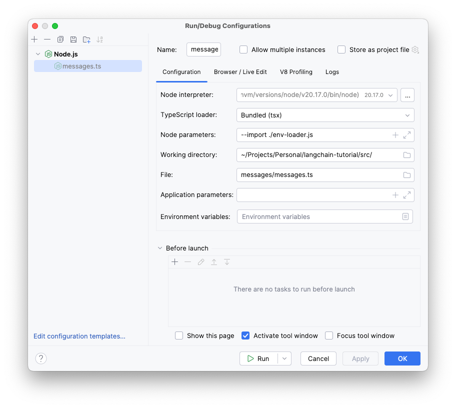

# LangChainJS Tutorial

Collection of LangChainJS Tutorials and Examples.

## Getting started

Make sure you have a `.env` in the root of the project.

An `env-loader.ts` is included to load up the `.env` file. You can use this to load up environment variables.
In WebStorm you can setup the run configuration to use this file before launching your main file.

