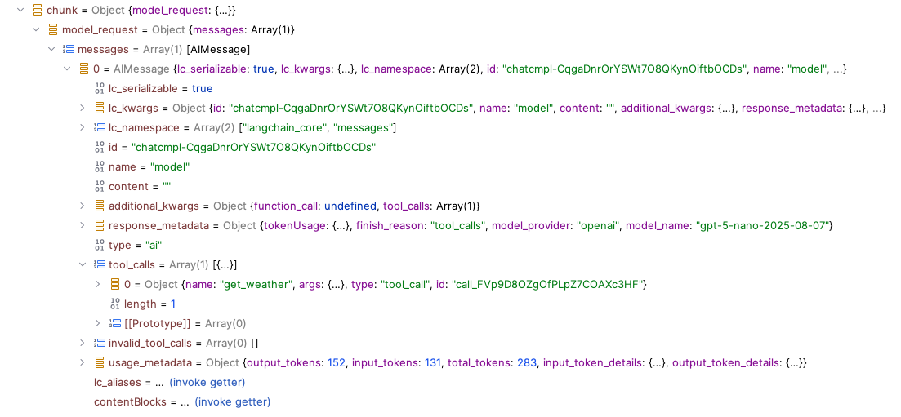
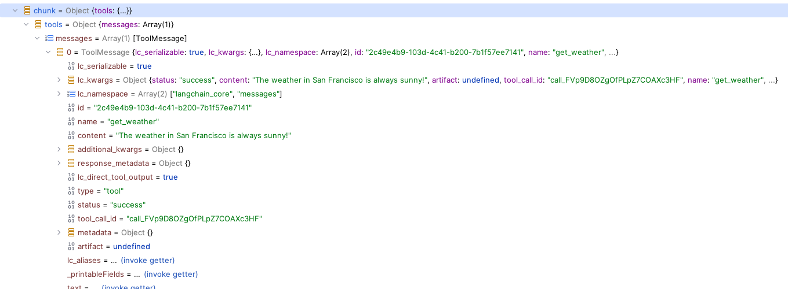
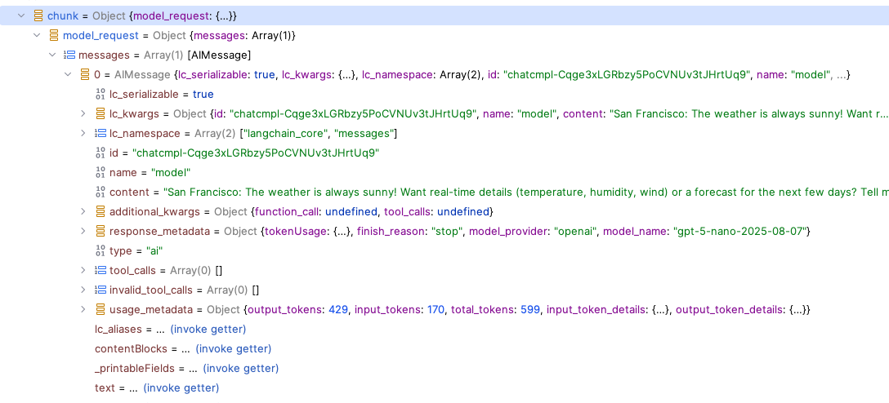

Creating an agent involves using the `createAgent` and giving it a model and a system prompt. 

```
const model = new ChatOpenAI({
    model: "gpt-4o-mini",
    temperature: 0
});

const agent = createAgent({
    model,
    systemPrompt: "You are a helpfull assistant",
});
```

Once we have that we can start using it.

There are 2 main ways of interacting with an agent:

- invoke : this will return a promise that resolves to the response
- stream : this will return a stream of responses


## Invoking

We can invoke the agent by using the `invoke` method.

```
const res = await agent.invoke({
    messages: [
        new HumanMessage({
            content: [
                {type: 'text', text: '"Hello World"',},
            ],
        }),
    ]
});
```
This will give us a list of messages back. The last message is typically the AIMessage the one we want to use.

```
const lastMessage = res.messages[res.messages.length - 1];
console.log(lastMessage.content);
```

**Important :** As you can see this returns a list of messages and not the single message we got the earlier call when we interacted with the model directly

```
const llm = new ChatOpenAI({
    model: "gpt-4o-mini",
    temperature: 0
});

const response = await llm.invoke("Hello World")
console.log(response.content)
```


## Streaming

Just like the invoke / stream methods on a model, we have the same methods on an agent.
The `streaming` method does behave a little bit differently though.

We can stream messages to the agent by using the `stream` method.

```
const stream = await agent.stream(
    { messages: [{ role: "user", content: input }] },
    { streamMode: "messages", configurable: { thread_id: "cli" } },
);
```

When you stream an agent you will get this type of object.

IT's an array consisting of 2 objects.

- AIMessageChunk
- LangGraphCheckpoint

```
[
  AIMessageChunk {
    "id": "chatcmpl-CqLzaVUbSIQGw2KzopjTtyDwp7jFk",
    "content": " assist",
    "additional_kwargs": {},
    "response_metadata": {
      "model_provider": "openai",
      "usage": {}
    },
    "tool_calls": [],
    "tool_call_chunks": [],
    "invalid_tool_calls": []
  },
  {
    tags: [],
    name: undefined,
    langgraph_step: 1,
    langgraph_node: 'model_request',
    langgraph_triggers: [ 'branch:to:model_request' ],
    langgraph_path: [ '__pregel_pull', 'model_request' ],
    langgraph_checkpoint_ns: 'model_request:d6c30dbd-cebf-5421-8ee2-0c70c571ebc9',
    __pregel_task_id: 'd6c30dbd-cebf-5421-8ee2-0c70c571ebc9',
    checkpoint_ns: 'model_request:d6c30dbd-cebf-5421-8ee2-0c70c571ebc9',
    ls_provider: 'openai',
    ls_model_name: 'gpt-4o-mini',
    ls_model_type: 'chat',
    ls_temperature: 0,
    ls_max_tokens: undefined,
    ls_stop: undefined
  }
]
```

otherwise you get this


```aiignore
{
  model_request: {
    messages: [
      AIMessageChunk {
        "id": "chatcmpl-CqcD0CuTJxPokeKi2ejCpYLK5aQUK",
        "content": "Creating a simple text-based version of the classic Snake game can be done using Python. Below is a basic implementation that you can run in your local environment. This version uses the `curses` library, which is available in most Python installations.\n\n### Snake Game in Python\n\n```python\nimport curses\nfrom random import randint\n\n# Set up the window\nstdscr = curses.initscr()\ncurses.curs_set(0)\nsh, sw = stdscr.getmaxyx()  # get height and width of window\nw = curses.newwin(sh, sw, 0, 0)  # create a new window\nw.keypad(1)  # enable keypad input\nw.timeout(100)  # refresh window every 100 milliseconds\n\n# Initial snake and food positions\nsnk_x = sw // 4\nsnk_y = sh // 2\nsnake = [\n    [snk_y, snk_x],\n    [snk_y, snk_x - 1],\n    [snk_y, snk_x - 2]\n]\nfood = [sh // 2, sw // 2]\nw.addch(int(food[0]), int(food[1]), curses.ACS_PI)\n\n# Game logic\nkey = curses.KEY_RIGHT  # initial direction\nwhile True:\n    next_key = w.getch()  # get user input\n    key = key if next_key == -1 else next_key\n\n    # Calculate new head of the snake\n    new_head = [snake[0][0], snake[0][1]]\n\n    if key == curses.KEY_DOWN:\n        new_head[0] += 1\n    if key == curses.KEY_UP:\n        new_head[0] -= 1\n    if key == curses.KEY_LEFT:\n        new_head[1] -= 1\n    if key == curses.KEY_RIGHT:\n        new_head[1] += 1\n\n    # Insert new head\n    snake.insert(0, new_head)\n\n    # Check if snake has eaten the food\n    if snake[0] == food:\n        food = None\n        while food is None:\n            nf = [\n                randint(1, sh - 1),\n                randint(1, sw - 1)\n            ]\n            food = nf if nf not in snake else None\n        w.addch(int(food[0]), int(food[1]), curses.ACS_PI)\n    else:\n        # Remove the last segment of the snake\n        tail = snake.pop()\n        w.addch(int(tail[0]), int(tail[1]), ' ')\n\n    # Check for collisions with borders or self\n    if (snake[0][0] in [0, sh] or\n            snake[0][1] in [0, sw] or\n            snake[0] in snake[1:]):\n        curses.endwin()\n        quit()\n\n    # Draw the snake\n    w.addch(int(snake[0][0]), int(snake[0][1]), curses.ACS_CKBOARD)\n```\n\n### Instructions to Run the Game\n\n1. **Install Python**: Make sure you have Python installed on your machine. You can download it from [python.org](https://www.python.org/downloads/).\n\n2. **Create a Python File**: Copy the code above into a file named `snake.py`.\n\n3. **Run the Game**: Open your terminal or command prompt, navigate to the directory where you saved `snake.py`, and run the command:\n   ```bash\n   python snake.py\n   ```\n\n4. **Control the Snake**: Use the arrow keys to control the direction of the snake. The goal is to eat the food (represented by `π`) and grow the snake without running into the walls or itself.\n\n### Note\n- The game will end if the snake collides with the wall or itself.\n- You can adjust the speed of the game by changing the `w.timeout(100)` value (lower values make the game faster).\n\nEnjoy playing the Snake game!",
        "name": "model",
        "additional_kwargs": {},
        "response_metadata": {
          "estimatedTokenUsage": {
            "promptTokens": 23,
            "completionTokens": 1154,
            "totalTokens": 1177
          },
          "prompt": 0,
          "completion": 0,
          "finish_reason": "stop",
          "system_fingerprint": "fp_644f11dd4d",
          "model_name": "gpt-4o-mini-2024-07-18",
          "service_tier": "default",
          "model_provider": "openai",
          "usage": {
            "prompt_tokens": 23,
            "completion_tokens": 833,
            "total_tokens": 856,
            "prompt_tokens_details": {
              "cached_tokens": 0,
              "audio_tokens": 0
            },
            "completion_tokens_details": {
              "reasoning_tokens": 0,
              "audio_tokens": 0,
              "accepted_prediction_tokens": 0,
              "rejected_prediction_tokens": 0
            }
          }
        },
        "tool_calls": [],
        "tool_call_chunks": [],
        "invalid_tool_calls": [],
        "usage_metadata": {
          "input_tokens": 23,
          "output_tokens": 833,
          "total_tokens": 856,
          "input_token_details": {
            "audio": 0,
            "cache_read": 0
          },
          "output_token_details": {
            "audio": 0,
            "reasoning": 0
          }
        }
      }
    ]
  }
}


```


## Streaming mode : Messages

to complete


        const [step, content] = Object.entries(chunk)[0];
        process.stdout.write(String(content.content || ""));


## Streaming mode : Updates

When you are streaming in updates mode you will get a stream of updates.

```

    for await (const chunk of await agent.stream(
        { messages: [{ role: "user", content: "what is the weather in sf" }] },
        { streamMode: "updates" }
    )) {
        const [step, content] = Object.entries(chunk)[0];
        console.log(`step: ${step}`);
        console.log(`content: ${JSON.stringify(content, null, 2)}`);
    }
```

These updates come in as chunks, clearly indicating if these are

- model request
- tool calls
- ,,,

The updates are structured in a way that you can "easily" extract the relevant information.

The main property of the chunk you get back will determine the type of messages


For the code example above we will get the following 3 updates : 

Update #1 



Update #2



Update #3


