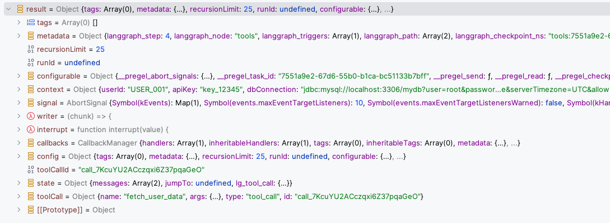
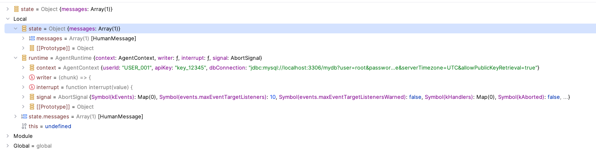

# Context

Some code samples showing you the use of context in LangChainJS

- Consider context as an immutable data structure that you inject in a conversation.
- It is available throughout the lifespan of the conversation.
- It is typically not altered by the user / agent / flow.
- It is passed along as the second argument of the `invoke` function.

The context is something you pass in when invoking the agent.


```
    const res = await agent.invoke({
            messages: [
                new HumanMessage({
                    content: [
                        {type: 'text', text: "Find info on user ID 1",},
                    ],
                }),
            ],
        },
        {
            context: { userId: "USER_001", apiKey: "key_12345", dbConnection: "jdbc:mysql://localhost:3306/mydb?user=root&password=&useSSL=false&serverTimezone=UTC&allowPublicKeyRetrieval=true" }
        }
    );

```


The second argument to the `invoke` function is the optional runtime configuration that can includes : 

- context : The context for the agent execution.
- configurable : LangGraph configuration options like `thread_id`, `run_id`, etc.
- store : The store for the agent execution for persisting state, see more in {@link https://docs.langchain.com/oss/javascript/langgraph/memory#memory-storage | Memory storage}.
- signal : An optional {@link https://developer.mozilla.org/en-US/docs/Web/API/AbortSignal | `AbortSignal`} for the agent execution.
- recursionLimit : The recursion limit for the agent execution.

That context is available in

- Tools
- Middleware

## Context in tools

Tool runtime available in tools

Tools can read from the context using the runtime object.

```


const fetchUserData = tool(
    async ({ query }, runtime: ToolRuntime<any, typeof contextSchema>) => {
        // Read from Runtime Context: get API key and DB connection
        const { userId, apiKey, dbConnection } = runtime.context;

        console.log(`Received ${query} : Fetching data for user ${userId} using API key ${apiKey} and DB connection ${dbConnection}`);

        return `Found 1 result for user ${userId}`;
    },
    {
        name: "fetch_user_data",
        description: "Fetch data using Runtime Context configuration",
        schema: z.object({
            query: z.string(),
        }),
    }
);
```



Middleware can access the context using the `runtime` object. (or via `request.runtime`)

```
const loggingMiddleware = createMiddleware({
    name: "LoggingMiddleware",
    beforeModel: (state,runtime) => {
        console.log(`About to call model with ${state.messages.length} messages and runtime.context.userId = ${runtime.context.userId}`);
        return;
    },
    ....
```    

## Context in middleware 

Agent runtime available in middleware


