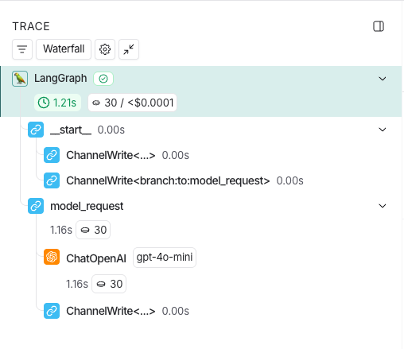
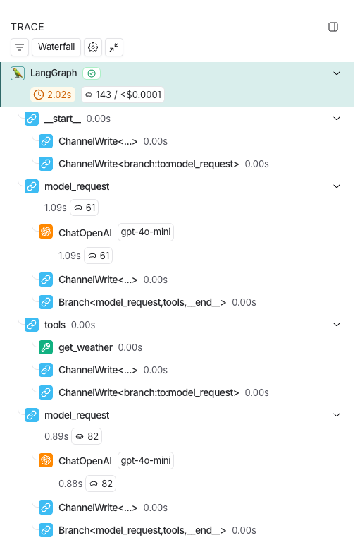

The simplest Langsmith trace looks like this.

We are seeing the following steps 

1.	Initialize run (__start__)
2.	Write initial input into state (`ChannelWrite<...>`)
3.	Decide next node (`ChannelWrite<branch:to:model_request>`)
4.	Execute node (model_request)
5.	Call the model (ChatOpenAI)
6.	Write model output back into state (`ChannelWrite<...>`)

Lets add a tool call 

1.	Graph run starts (LangGraph)
2.	Enter __start__
3.	ChannelWrite<…> (initial state write)
4.	ChannelWrite<branch:to:model_request> (route to first node)
The runtime decides the first executable node is model_request.
5.	First model_request runs
This node is responsible for deciding what to do next (answer directly vs call a tool).
6.	First ChatOpenAI (gpt-4o-mini) call (~61 tokens, ~1.09s)
The model responds, and (in this run) it decides a tool needs to be called.
7.	ChannelWrite<…> (persist model output)
The model output (often an AIMessage containing a tool call) is merged into state.
8.	Branch<model_request, tools, __end__> (routing decision)
Based on the updated state, the graph routes to tools (because a tool call is present).
9.	tools node runs
This node executes the requested tool(s).
10.	get_weather tool executes
The actual tool function runs (fast here: ~0.00s) and produces a tool result.
11.	ChannelWrite<…> (persist tool result)
The tool output (often a ToolMessage) is written back into the channels (typically appended to messages).
12.	ChannelWrite<branch:to:model_request> (route back to model)
The runtime schedules another model_request so the model can incorporate the tool result into a final answer.
13.	Second model_request runs
Now the state includes: user prompt + tool call + tool result.
14.	Second ChatOpenAI (gpt-4o-mini) call (~82 tokens, ~0.89s)
The model generates the “final” natural-language response using the tool output.
15.	ChannelWrite<…> (persist final AI message)
The final AIMessage is merged into state.
16.	Branch<model_request, tools, __end__> (final route)
No further tool call is needed, so the graph routes to __end__ and completes.