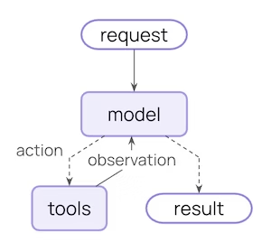
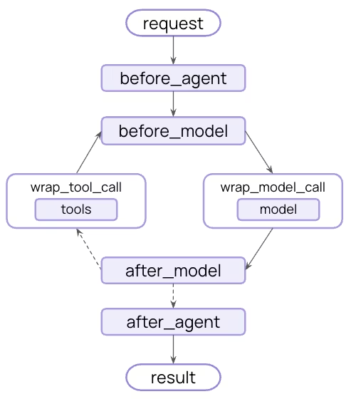

# Middleware

Control and customize agent execution.


Simple hook :


Middleware hooks


## hooks

### Node style hooks 

- beforeAgent - Before agent starts (once per invocation)
- beforeModel - Before each model call
- afterModel - After each model response
- afterAgent - After agent completes (once per invocation)

use-cases: logging, validation, and state updates.

#### BeforeAgent

Invoked only once for the entire agent invocation

#### BeforeModel

Invoked just before each model call.


### Wrap style hooks

- wrapModelCall - Around each model call
- wrapToolCall - Around each tool call

use-cases: retries, caching, and transformation.


## use-cases

- logging
- analytics
- debugging
- tool selection
- output formatting
- retries / fallbacks
- termination logic
- rate limits
- guardrails

## Default middleware

- Summarization	Automatically summarize conversation history when approaching token limits.
- Human-in-the-loop	Pause execution for human approval of tool calls.
- Model call limit	Limit the number of model calls to prevent excessive costs.
- Tool call limit	Control tool execution by limiting call counts.
- Model fallback	Automatically fallback to alternative models when primary fails.
- PII detection	Detect and handle Personally Identifiable Information (PII).
- To-do list	Equip agents with task planning and tracking capabilities.
- LLM tool selector	Use an LLM to select relevant tools before calling main model.
- Tool retry	Automatically retry failed tool calls with exponential backoff.
- Model retry	Automatically retry failed model calls with exponential backoff.
- LLM tool emulator	Emulate tool execution using an LLM for testing purposes.
- Context editing	Manage conversation context by trimming or clearing tool uses.

- Custom state schema

Add a `stateSchema` to the middleware options to define custom state.
Can contain punlic or private properties.(private properties start with `_`)
State is updated by returning a new state object from the beforeModel and afterModel hooks.

state is available in all hooks.
in the noder style hooks, the state is passed as the first argument.
in the wrap style hooks, the state is accessible via ...


```
const callCounterMiddleware = createMiddleware({
  name: "CallCounterMiddleware",
  stateSchema: z.object({
    modelCallCount: z.number().default(0),
    userId: z.string().optional(),
  }),
  beforeModel: (state) => {
    if (state.modelCallCount > 10) {
      return { jumpTo: "end" };
    }
    return;
  },
  afterModel: (state) => {
    return { modelCallCount: state.modelCallCount + 1 };
  },
});
```
